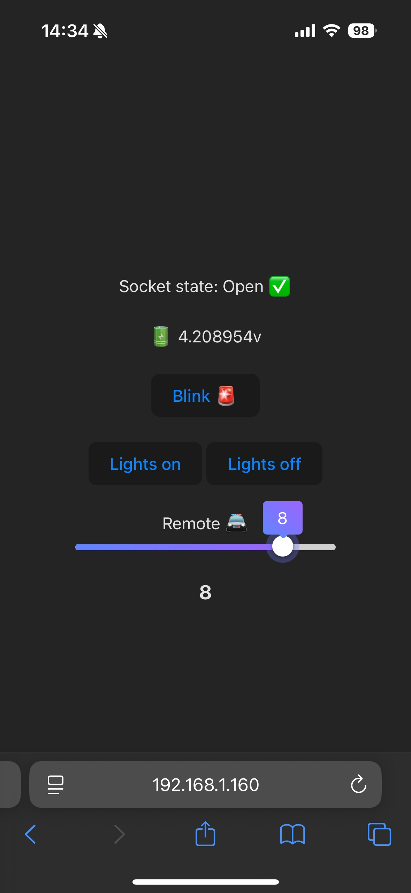

# pico-2w-with(out)-robo-pico
Testing pico 2w and robo pico board and other stuff.

Just for testing couldnt, no time has been spent making it nearly what production code should look like, just experiment.

## Svelte frontend 
- for small size
- Range slider is from https://svelte.dev/playground/7f0042a186ee4d8e949c46ca663dbe6c?version=5.23.2

## Microdot backend - for small size
- for small size
- wifi connection logic is from https://docs.sunfounder.com/projects/pico-2w-kit/en/latest/pyproject/iotproject/1-access.html#py-iot-access

# Example

Gui on phone after new features

The example is of my sons police car (not mine), and it now uses the battery from the car instead of LiPo (since why Robo pico board takes so much space and I dont have LiPo shim for pico), and uses MP6550 as motor controller. It's uses the original power supply for the motor, just through the motor controller. The original functionality works fine.

Now a PWA, no need to remember the address to the web page anymore!

## Build
Build svelte and replace the corresponding files from dist in to-pico folder.
Notice how some files are in assets folder and therefore needs to be updated in the paths.
Merge changes, and maybe fix the paths in the config-files from the beginning...

## Redeploy 
Deploy to-pico to pico, make your own certificates.